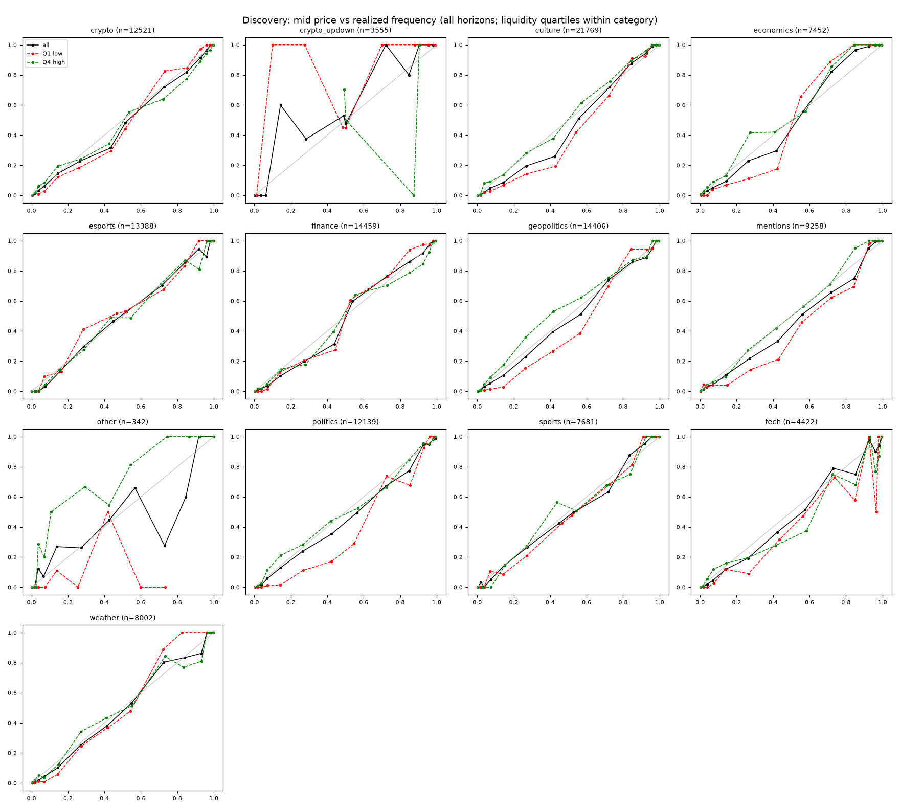
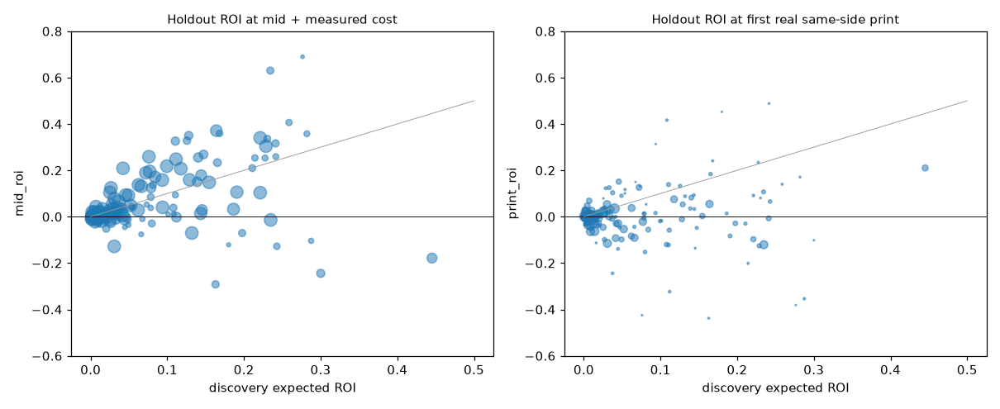

# Case study: are Polymarket prices miscalibrated anywhere, tradeably?

**Verdict: no tradeable miscalibration.** Mid prices look miscalibrated in a systematic, out-of-sample-stable way,
but only where books are thin, and those mids cannot be traded. With entries only at real prints, **1 of 200**
frozen candidates passed every criterion. It is worth about $5/day and does not survive a multiple-testing
correction on the holdout.

## Universe

Gamma keyset crawl of closed markets with an end date from 2025-01-01, crawled 2026-09-28: **1,046,595 events and
3,577,448 markets**. The category comes from tag slugs, first match wins. Crypto "Up or Down" markets
(5 minutes to 4 hours) are split out because they are about 22% of all markets.

| Category | Events | Markets | Resolved early >1h | YES rate | Median life |
|---|---|---|---|---|---|
| sports | 200,661 | 1,970,959 | 35.0% | 34.5% | 2.1 d |
| crypto_updown | 771,764 | 774,044 | 0.1% | 50.0% | 1.0 d |
| esports | 26,441 | 324,669 | 50.7% | 40.9% | 0.8 d |
| crypto | 16,564 | 200,126 | 2.2% | 42.2% | 0.1 d |
| weather | 14,493 | 151,856 | 10.8% | 9.6% | 2.5 d |
| finance | 5,400 | 36,492 | 21.5% | 37.7% | 6.9 d |
| mentions | 1,825 | 30,309 | 33.7% | 31.7% | 5.1 d |
| culture | 2,734 | 17,783 | 32.8% | 18.0% | 8.4 d |
| politics | 2,359 | 9,766 | 23.0% | 21.4% | 30.8 d |
| geopolitics | 2,461 | 8,972 | 36.4% | 23.7% | 22.3 d |
| tech | 832 | 5,657 | 45.4% | 15.9% | 10.6 d |
| economics | 764 | 3,769 | 12.2% | 18.2% | 28.8 d |

Clean set: 3,515,697 markets after removing prices that are not exactly 1/0 (56,501), disputed markets (3,166) and
`arch-` copies (2,202). "Resolved early" is `closedTime` more than 1 h before `endDate`; for sports and esports that
mostly reflects placeholder end dates, not news.

## Sample and snapshots

- Up to 3,000 random clean events per category, up to 3 random markets per event. 63,416 markets and 27,144 events
  ended up with at least one valid snapshot, 328,909 snapshots in total.
- Snapshots at 30 d, 7 d, 1 d, 6 h and 1 h before the scheduled end, plus 10%, 50% and 90% of each market's life.
  The price is the last CLOB point at or before the target, at most 60 minutes stale.
- Guard: no snapshot at or after `closedTime - 1h`, none before creation. That dropped, for example, 19,095 of the
  68,616 nominal 1 h snapshots.
- Measured taker cost vs the 1-minute mid from 1.35M trades in 8,428 markets. Typical medians: 0.5¢ in sports,
  0.25-1.5¢ in politics, geopolitics and mentions, 1-2¢ in crypto up/down, weather, finance, tech and culture.
- Split: discovery = events ending before 2026-04-01 (11,271 events, 129k snapshots); holdout = on or after
  (15,873 events, 200k snapshots).

## Discovery: what the mids say

`diff` = realized frequency minus mean mid. Negative means the priced side was overpriced.

**Favorite-longshot bias:**

| Band | Mean mid | Realized | diff (95% CI) |
|---|---|---|---|
| 1-3¢ | 0.018 | 0.009 | -0.9 pp (-1.2, -0.7) |
| 5-10¢ | 0.071 | 0.050 | -2.1 pp (-2.8, -1.4) |
| 20-35¢ | 0.270 | 0.232 | -3.7 pp (-5.0, -2.5) |
| 35-50¢ | 0.434 | 0.362 | -7.2 pp (-8.5, -5.8) |
| 65-80¢ | 0.722 | 0.711 | -1.1 pp (-3.1, +0.8) |
| 97-99¢ | 0.981 | 0.994 | +1.4 pp (+1.0, +1.7) |

**It lives in illiquid markets** (quartile of volume per day within category):

| Band | Q1 (low) | Q2 | Q3 | Q4 (high) |
|---|---|---|---|---|
| 5-10¢ | -4.8 pp | -2.5 | -1.2 | +1.1 (CI -0.8, +3.0) |
| 20-35¢ | -9.7 pp | -7.4 | +1.1 | +1.9 (CI -1.0, +4.8) |
| 35-50¢ | -15.5 pp | -5.6 | -5.0 | +3.2 (CI 0.0, +6.3) |

**And in negRisk buckets.** In the 35-50¢ band: negRisk buckets -12.8 pp, multi-market non-negRisk -3.2 pp,
standalone binaries -0.6 pp (CI -4.0, +2.8). The median sum of mids in complete negRisk events was 1.007-1.019,
and 68-75% of events summed to more than 1. At the same price the cheap YES side was overpriced (35-50¢ YES
-10.5 pp vs NO +0.7 pp). No consistent horizon effect.



The interpretation, written down before touching the holdout: in thin books the mid sits between a low bid and a
high ask, so a cheap YES mid overstates the probability and the mids of an event add up to more than 1. Selling that
means buying NO at `1 - mid`, but the NO ask in such books is far above `1 - mid`. The measured taker cost comes from
markets that actually trade, so it understates the cost exactly where the gaps are.

## Screening and freezing

599 cells (category × band × horizon, plus pooled cells) had at least 100 discovery events. 232 were significant at
Benjamini-Hochberg q = 0.05, and 200 of those had positive expected ROI at mid + measured median cost + fee. They
were written to `candidates.json` (sha256[:16] `57c4483d6b74bb8d`) before any holdout data was read. The top cells
were almost all "buy NO" in 20-65¢ YES bands: culture, mentions, finance, crypto, economics, esports.

## Holdout

Up to 400 random holdout events per candidate, 81,424 snapshot-trades, taker trades for all 24,909 markets
involved. Pass criteria: ROI > 0, event-block and date-block CIs above 0, at least 200 events, positive without the
top 5 events, no single series dominating the PnL, and enough fillable volume per day to matter.

| Execution model | ROI > 0 | CI > 0 (event and date) | ≥ 200 events | Pass all |
|---|---|---|---|---|
| Mid + measured cost (not executable) | 154 | 93 | 109 | **25** |
| First real same-side print within 60 min | 129 | 73 | 11 | **1** |
| Same, and print ≤ mid + cost (limit order) | 114 | 80 | 0 | **0** |



- **The mid pattern replicates.** 25 candidates would pass if you could trade at the mid, e.g. crypto 35-50¢ NO +37%,
  culture 35-50¢ NO +34%.
- **Real fills kill it.** Only 19% of snapshots (median across candidates) see a same-side print within 60 minutes.
  Where a print exists, its price removes most of the gap: crypto 35-50¢ NO goes from +37% at mid to +5.5% at the
  print on 134 events, culture from +34% to -9.7%.
- **The single pass**: candidate #133, crypto, 97-99¢, all horizons, buy YES (favorites underpriced). Print ROI
  +0.65% (CI +0.30%, +1.04%) on 250 events, +0.39% without the top 5 events. The top series is 37% of PnL.
  Fillable volume is about $710/day, i.e. about $4.6/day expected profit. Its holdout p ≈ 5e-4 is above the
  Bonferroni threshold of 2.5e-4 for 200 candidates, and about 5 false passes are expected by chance at this CI
  level.

## Verdicts

| Family | Discovery | Holdout at mid | Holdout at real prints | Verdict |
|---|---|---|---|---|
| Buy NO against cheap YES (5-65¢), illiquid / negRisk | large, BH-significant | replicates | gap closes at the ask; ≤ 134 fillable events | artifact of mid pricing in thin books |
| Buy NO on 0-3¢ longshots (54 cells) | +0.1-1.7% | median +0.35% | median +0.24%, ≤ 277 events | too small; none passes |
| Buy YES on 97-100¢ favorites (22 cells) | +0.02-1.5% | median +0.39% | median +0.25%; crypto 97-99 +0.65% (1 pass) | real but tiny; fails multiple testing; ~$5/day |
| Horizon, YES bias as such | not separable from liquidity / structure | - | - | no independent effect |

Nothing here deserves a dedicated model. The only persistent tilt at executable prices is the familiar small
favorite underpricing at 97-100¢: below 1% per trade, with tail risk, and a few dollars a day. Quoting the cheap
side of thin negRisk books would be the only way to monetize the mid pattern, and that needs order-book history.

## Reproduce

```bash
uv run pmrk fetch markets --start 2025-01-01 --end 2026-10-01          # all closed events: a long crawl
uv run pmrk snapshot --sample 3000 --per-event 3                          # fetches targeted price windows
uv run pmrk fetch trades --category sports politics crypto              # pick a cost subset per category
uv run pmrk fetch prices --category sports politics crypto --lookback 5d
uv run pmrk costs --by category
uv run pmrk calibration discover --split 2026-04-01
uv run pmrk calibration holdout --split 2026-04-01 --fetch-trades
```

The original study sampled trades and 1-minute mids for a 300-event cost subset per category rather than for every
market. With the commands above you choose that subset yourself with `--event` or `--category`.
