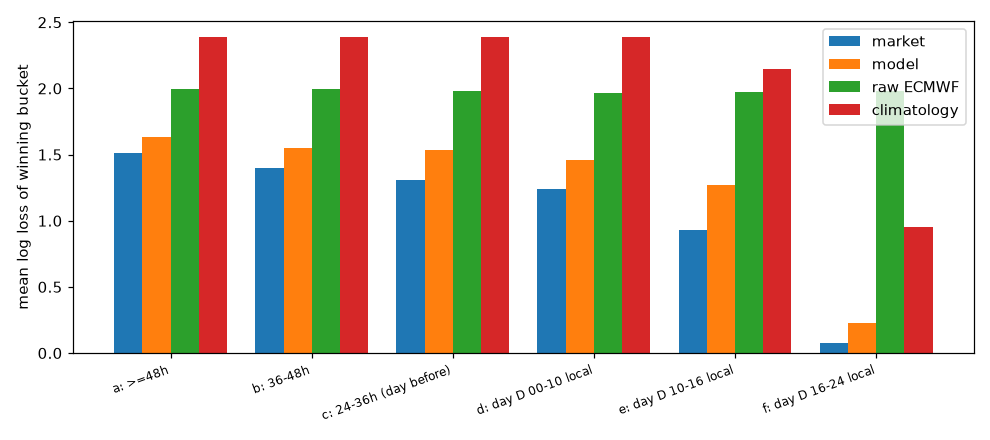
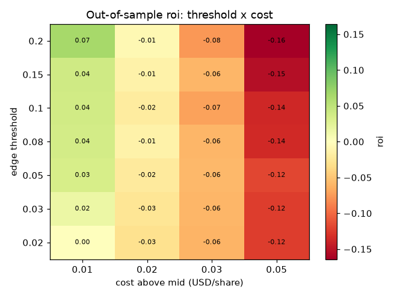

# Case study: daily highest-temperature markets

**Verdict: no-go.** Calibrated public-NWP + METAR probabilities did not beat Polymarket's own prices on
out-of-sample log loss at any horizon. Every taker strategy built on them lost money after fees at 2-5¢ of cost,
with 95% bootstrap CIs entirely below zero. The one residual that looked profitable turned out to be an artifact of
observation timing. Data cut: 2026-09-27.

## The markets

Polymarket lists a daily event per city: "Highest temperature in NYC on June 10?", split into buckets (ranges like
`44-45°F`, single degrees like `26°C`, plus open-ended tails such as `36°C or higher`). Each bucket is a Yes/No market in one negRisk event. The event
resolves on the day's max temperature at a named airport station, as shown by a named source page.

| Dataset | Source | Coverage |
|---|---|---|
| Markets | Gamma, 59 `*-daily-weather` series | 11,255 events / 117,690 buckets, 2025-01-22 to 2026-09-29, 57 cities |
| Backtest universe | closed, one YES winner, METAR-settled, not `arch-`, opened before the local day | 10,515 events, 53 stations |
| Prices | CLOB `prices-history`, explicit windows, 1-minute | all 10,899 closed METAR events |
| Trades | Data API, taker only | all taker trades |
| Observations | IEM ASOS archive, routine + SPECI | 55 stations, 2023-01 to 2026-09 |
| Forecasts | ECMWF IFS 0.25° and GFS 0.5° exact runs from AWS | 3,708 runs per model, 2024-03-14 to 2026-09-26 |

## Step 1: reproduce settlement

Rule: local-day max over **all** METAR reports including SPECIs. degF markets use the T-group tenths of degC,
converted and rounded half-up. degC markets use the integer main group.

| Unit / source | Events | Reproduced |
|---|---|---|
| °F / Wunderground | 2,719 | 100.0% |
| °F / NOAA timeseries | 385 | 99.7% |
| °C / Wunderground | 5,649 | 97.4% |
| °C / NOAA timeseries | 1,709 | 99.3% |
| All clean events | 10,462 | 98.45% (~99.8% excluding ZGSZ and RKSI) |

- Moscow UUWW needs routine reports only (its SPECIs never reach the NOAA page): 100% vs 93.8%.
- Shenzhen ZGSZ and Seoul RKSI cannot be reproduced from the IEM archive. They were excluded from the backtest by a
  filter computed on the tuning half only.
- Hong Kong (Observatory, 0.1°C) and early Taipei markets do not settle on METAR and were excluded.
- The administratively resolved `arch-` events of 2026-05-17..19 reproduce at 81%. Replacement events created after
  the day had ended were excluded from trading.

## Step 2: the model

Per-horizon Gaussian EMOS on a bias-corrected forecast mean (30-day trailing station bias with a 4-day gap). On the
resolution day the settlement value is `max(observed max so far, R)`, with a Gaussian model for `R`, the max of the
remaining reports. Interval-censored MLE, walk-forward monthly refits trained strictly before each test month.

The first version (v1) used 5 models from the Open-Meteo Previous Runs API. Its CRPS beat raw ECMWF with a fixed
spread and climatology at every pre-day horizon (0.76 vs 1.16 vs 1.96 degC at 24-36 h) and its 90% intervals
covered about 90%. A well-calibrated model, in other words. It lost to the market anyway.



The final version (v2) switched to exact single runs from the public AWS archives (ECMWF IFS 0.25° and GFS 0.5°).
The median forecast age at decision time fell from 19 h to 10 h. It also added richer intraday features: station
climatology of the peak hour and remaining rise, 3 h trend, clouds, convection, wind, and per-station effects.

## Step 3: model vs market

Mean log loss of the winning bucket, model minus market, 7 unreliable-settlement stations excluded, date-block
bootstrap 95% CI:

| Horizon | v1 | v2 |
|---|---|---|
| ≥ 48 h | +0.126 (0.109, 0.144) | +0.162 (0.147, 0.178) |
| 36-48 h | +0.156 (0.141, 0.169) | +0.229 (0.214, 0.244) |
| 24-36 h | +0.224 (0.209, 0.238) | +0.264 (0.250, 0.278) |
| Day D 00-10 | +0.220 (0.207, 0.233) | +0.255 (0.240, 0.270) |
| Day D 10-16 | +0.324 (0.311, 0.337) | +0.242 (0.229, 0.256) |
| Day D 16-24 | +0.058 (0.046, 0.077) | +0.044 (0.033, 0.061) |

Fresher runs helped on the resolution day and did not compensate for going from 5 models to 2 before it. Worse than
the market at every horizon for both versions: the kill criterion agreed before the study.

## Step 4: backtest anyway

Taker only. Decisions at every UTC hour, a minute after every forecast run becomes available, and 10 minutes after
every METAR on day D. Buy YES or NO at mid plus cost, pay the Polymarket fee where enabled, fill only if the market
traded within ±60 min, size at most 10% of that window's taker volume, one entry per bucket and side. Threshold tuned
on events before 2026-06-10; results on the second half (109 days).

| Cost above mid | Trades | ROI (95% CI) |
|---|---|---|
| 1¢ | 18,810 | +6.6% (+1.9%, +12.5%) |
| 3¢ | 16,444 | -7.5% (-10.9%, -3.9%) |
| 5¢ | 14,453 | -16.3% (-19.2%, -13.2%) |
| 0.15 Kelly, 3¢ | 7,862 | -2.4% (-8.6%, +4.7%) |



In v1 the average claimed edge at entry was 5.9¢/share against a realized -3.0¢. The "edges" were model error, not
mispricing.

## Step 5: the residual

Charging each trade the measured taker cost for its price band gave a positive number:

| Band cost | v2 ROI (95% CI) | Without top 5 days | Cities positive |
|---|---|---|---|
| median | +6.8% (+2.9%, +10.8%) | +3.8% | 27/46 |
| mean | +3.9% (-0.5%, +9.1%) | +0.5% | 23/46 |
| p75 | +1.6% (-3.0%, +6.5%) | -2.1% | 21/46 |

Almost all of it came from resolution-day decisions triggered by a fresh METAR: 6,115 trades at +18.5%, against
+0.1% for the hourly grid. The biggest wins were NO buys at 3¢ or less on buckets the market still held at 95% or
more while the latest METARs already made them unlikely.

Three follow-up checks, with no new data:

**Observation lag.** METARs usable from `obs_time + lag`, METAR-triggered trades only:

| Lag | Band-median cost | Flat 3¢ |
|---|---|---|
| 10 min | +12.3% (+6.9%, +17.9%) | +1.5% (-3.1%, +6.6%) |
| 15 min | +10.1% (+4.9%, +15.5%) | -0.5% (-4.9%, +4.7%) |
| 20 min | +5.3% (+0.1%, +10.8%) | -4.5% (-8.7%, +0.4%) |
| 30 min | -0.5% (-4.9%, +4.0%) | -9.9% (-13.5%, -6.0%) |

**Fillability.** Did a real taker buy the same exposure at or below our price within 5 minutes?

| Subset | Trades | ROI (95% CI) | PnL over 109 days |
|---|---|---|---|
| All | 6,115 | +18.5% | $13.1k |
| Passed | 1,240 (20.3%) | +19.3% (+4.3%, +34.8%) | $3.9k |
| Passed, capped to that print volume | 1,240 | +27.0% (+8.9%, +46.9%) | $2.2k (about $20/day) |

**Market reaction.** For the top 200 winning METAR trades, the time from observation to the first mid move of more
than 5¢ toward the outcome:

| Percentile | 10th | 25th | 50th | 75th | 90th |
|---|---|---|---|---|---|
| Minutes | 2.2 | 14.1 | 31.2 | 61.1 | 90.1 |

**Verdict: artifact.** The gain shrinks in step with the market's own reaction curve and is gone at about the median
reaction time. Most likely, much of the "edge" comes from treating a METAR as public 10 minutes after its
observation, while the settlement pages and the market seem to see it 15-60 minutes later. 80% of the signal trades
had no real print at our price. What is left is about $20/day before any competition on latency. The archive has no
receipt timestamps, so a genuine latency edge can be neither ruled out nor validated historically.

## Reproduce

```bash
uv sync --extra weather
uv run pmrk weather markets       # crawl all *-daily-weather series
uv run pmrk weather stations
uv run pmrk weather prices        # large: 1-minute history for every closed event
uv run pmrk weather trades
uv run pmrk weather metar         # IEM throttles hard: this takes hours
uv run pmrk weather settlement    # reproduction table
uv run pmrk weather forecasts     # exact ECMWF/GFS runs from AWS (range requests, resumable)
uv run pmrk weather fit           # walk-forward EMOS
uv run pmrk weather eval          # model vs market log loss by horizon
uv run pmrk costs --category weather
uv run pmrk weather backtest --band-cost median
uv run pmrk weather backtest --band-cost median --obs-lag 20m
```

The toolkit's guards are stricter than the original study's: no decision in the hour before a market's earliest
end / close / resolution. A re-run therefore gives similar but not identical numbers to the ones above.
